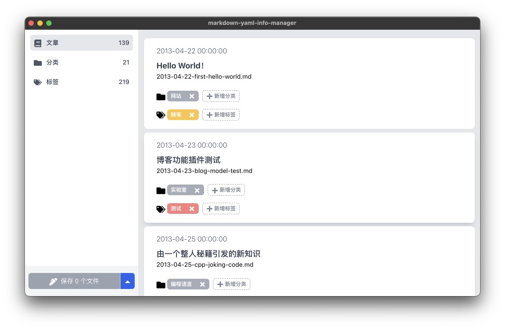

# markdown-yaml-info-manager

## 这是什么？

`markdown-yaml-info-manager` 是一个用于整理 `Hexo` 博客文章 _分类_ 和 _标签_ 的小工具。

`markdown-yaml-info-manager` is a gadget for organizing _categories_ and _tags_ in `Hexo` posts.



## 核心功能

* 解析Hexo的md文章，提取其中的文章分类和标签信息，并进行展示
* 保存修改后的文章分类和标签信息

**为什么不支持文章修改？**

本工具只专注于对 _标签_ 和 _分类_ 进行管理。
虽然提供一个编辑器编辑文章能够提供些许便捷，但是每个人的写作习惯不同，而且我也没有信心能将本工具打造成一个我心目中完美的编辑器。
所以编辑器功能就无限期的鸽了，文章编辑可以用 `vscode` 等专业编辑器作为补充。

## 里程碑

* [x] 项目搭建
* [x] 文章解析
* [x] 展示 _分类_ 和 _标签_
* [x] 重命名 _分类_ 和 _标签_
* [x] 保存 _分类_ 和 _标签_ 信息
* [x] 支持在文章列表快速添加修改 _分类_ 和 _标签_
* [x] 支持调整 _分类_ 的上下级顺序
* [x] 支持新增空白的 _分类_ 和 _标签_
* [x] 拥有一个完美的图标
* [ ] 文章列表支持按照 _分类_ 、 _标签_ 和 名称进行高级过滤
* [ ] 支持拖拽增加 _分类_ 和 _标签_
* [ ] i18n

## 下载地址

https://github.com/sumy7/markdown-yaml-info-manager/releases/

## 构建

本项目使用以下开源依赖进行构建：

- [Electron](https://www.electronjs.org/)
- [Node.js](https://nodejs.org/en/)
- [Vue CLI](https://cli.vuejs.org/)
- [Vue CLI Plugin Electron Builder](https://nklayman.github.io/vue-cli-plugin-electron-builder/)

## 贡献代码

欢迎喜欢本项目的人前来贡献代码，有任何问题也可以提交 issues 。

### 代码使用

```bash
# Project setup
yarn install

# Project development server
yarn electron:serve

# Run your unit tests
yarn test:unit

# Run your end-to-end tests
yarn test:e2e

# Compiles and release for production
yarn electron:build

# Lints and fixes files
yarn lint
```

## 许可协议

MIT
